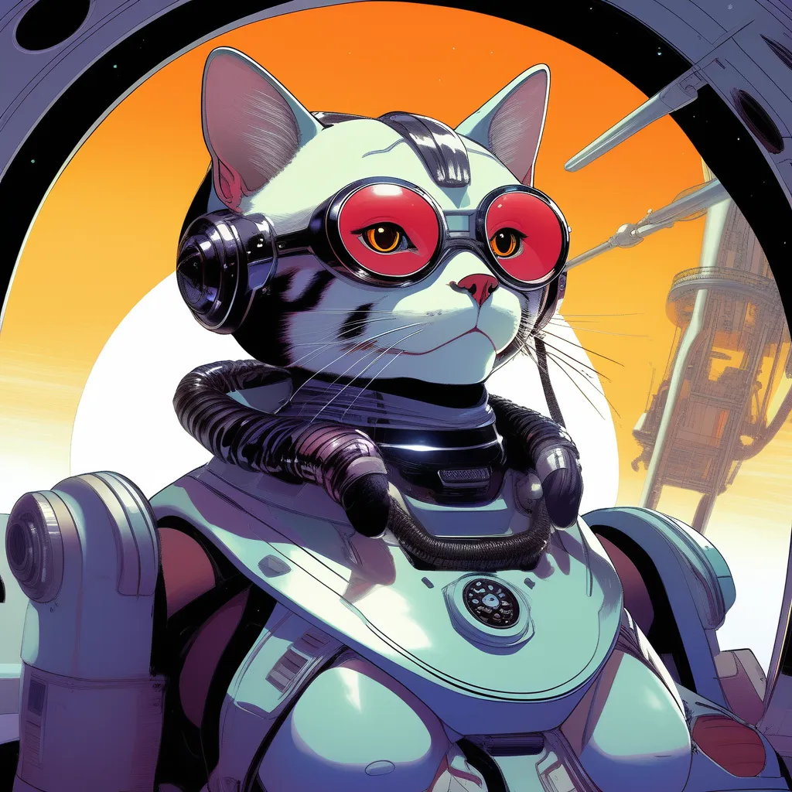

# hydit-live
A simple gradio interface for local image generation with HunYuan-DiT.
### Background Information:
https://arxiv.org/abs/2405.08748 (Original HyD publication)

https://huggingface.co/Tencent-Hunyuan/HunyuanDiT (Main HuggingFace Repo)

*In a nutshell, HyD offers impressive capabilities due to its bilingual training dataset and ability to take long, detailed natural language descriptions as prompts.*

## Installation and use:
It is recommended to create a virtual environment first! In powershell:
```
python -m venv venv
```
Then, activate the enviroment
```
.\venv\Scripts\activate.ps1
```
and run
```
pip install -r requirements.txt
app_opt.py
```
to launch the gradio session in your browser. The session creates a share link by default for use over the internet.

### Recommended settings:
Inference Steps: 30-50

Guidance Scale: 5-7 (use integers only!)

#### Obligatory cat sample @ 50 Steps, Guidance = 7, Random Seed:


Prompt:
*Draw a multidimensional android feline high admiral onboard a latent spacecraft as character portrait in the style of Tetsuya Nomura from circa 1997. Make the portrait look like an official promotional poster for a video game.*

You can prompt more like chatting with an LLM-- HyD does not require SD/SDXL style comma separated prompts (*feline high admiral onboard a latent spacecraft, character portrait in the style of Tetsuya Nomura, 1997, official promotional poster*), but you can do so if you wish. 

### Notes:
Tested on NVIDIA RTX 40XX, Windows 11.

#### Coming Soon:
-TensorRT version (large speedup on NVIDIA RTX)

-Apple Silicon version (in alpha)
